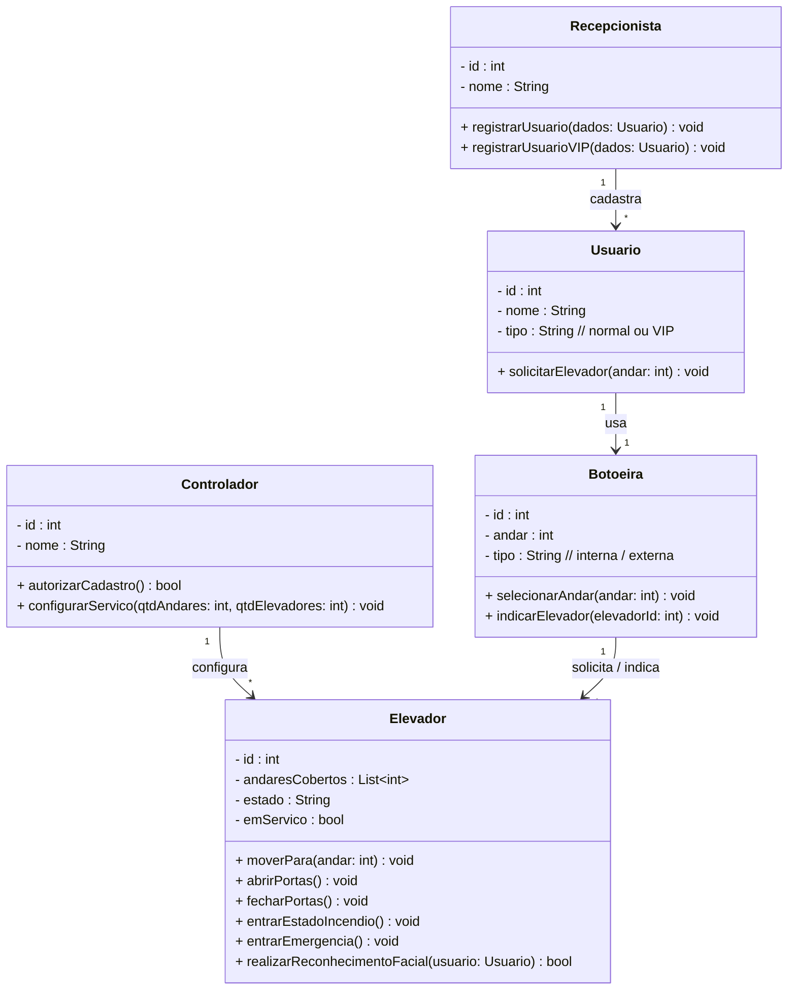
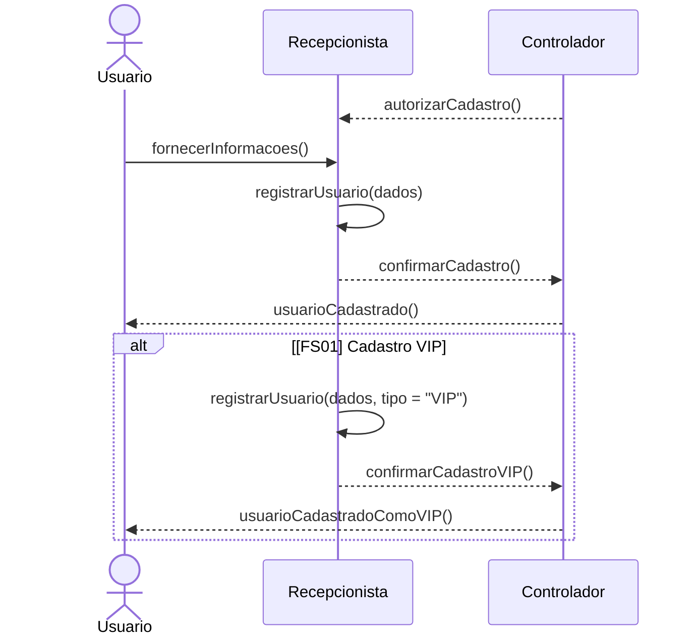
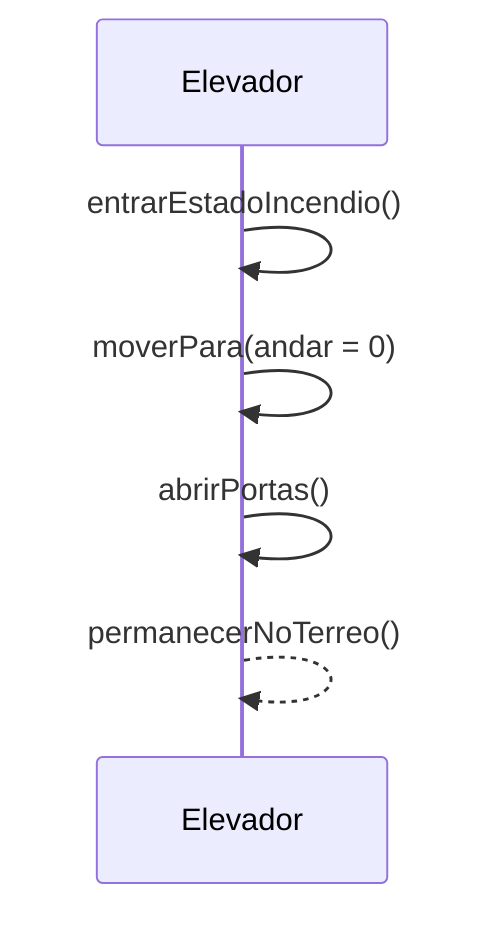
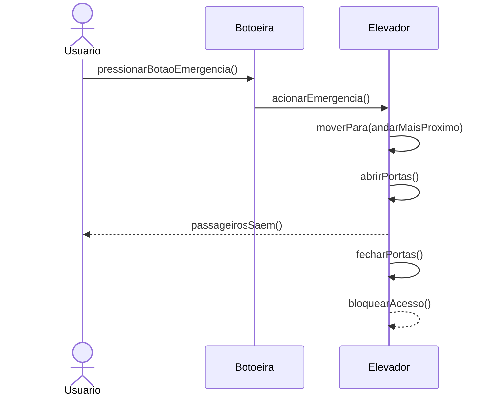
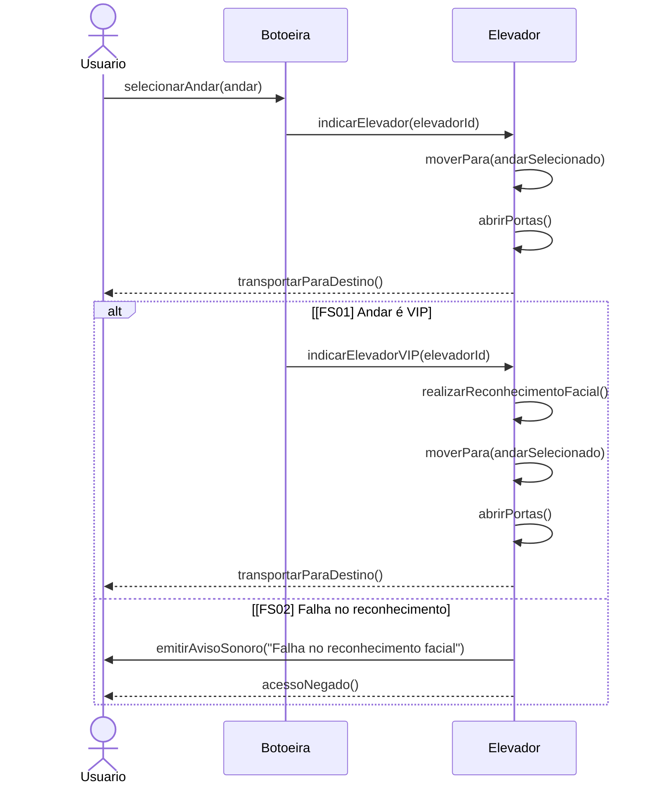
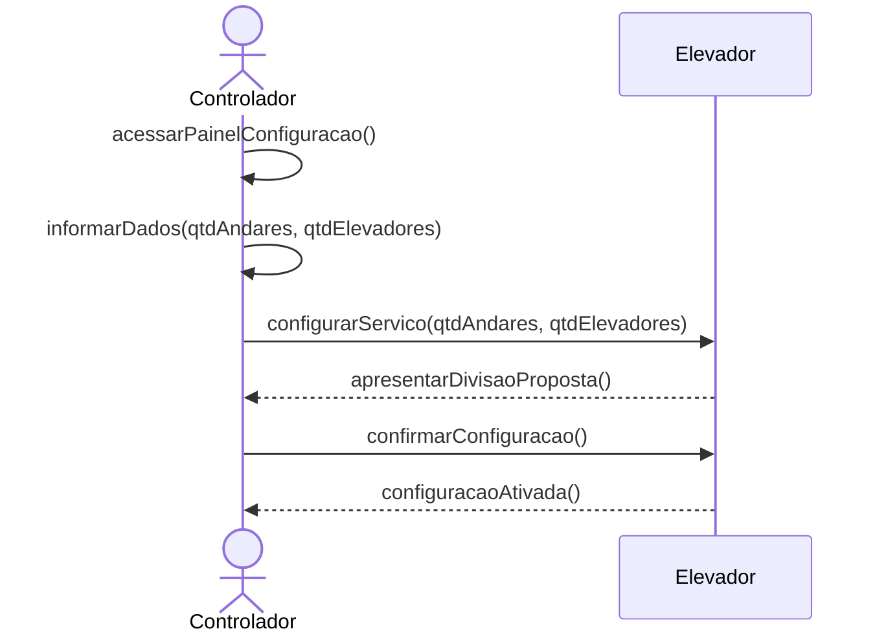

# Projeto-2-Modelagem
UML de um sistema para  o controle de elevadores em uma rede de hotéis

## Diagrama de Atores 

## Casos de Uso

| Identificação | UC - 01 |
|---|---|
| Função | Registrar usuário | 
| Atores | Usuário, Controlador, Recepcionista | 
| Prioridade | Essencial | 
| Pré-Condição | Controlador autoriza o recepcionista a adicionar pessoas no sistema  Sistema funcionando | 
| Pós-Condição | Usuário cadastrado | 
| Fluxo Principal | * Usuário cede suas informações ao recepcionista    * Recepcionista registra usuário no sistema [FS01] |
| Fluxo Secundário [FS01] | *Recepcionista registra usuário no sistema como VIP|

 

| Identificação | UC - 02 |
|---|---|
| Função | Ativar estado de incêndio | 
| Atores | Elevador | 
| Prioridade | Essencial | 
| Pré-Condição | Elevador funcional | 
| Pós-Condição | Elevador com portas abertas no térreo até situação normalizar | 
| Fluxo Principal | * O sensor de fumaça do predio capta fumaça   * Predio entra em estado de incêndio   * Elevador se dirige ao térreo   * Elevador abre as portas e permanece no terreo até a situação normalizar | 

 

| Identificação | UC - 03 |
|---|---|
| Função | Ativar estado de emergência | 
| Atores | Elevador, Usuário | 
| Prioridade | Essencial | 
| Pré-Condição | Elevador funcional | 
| Pós-Condição | Elevador bloqueado até estado de emergência ser desativado | 
| Fluxo Principal | * Botão de emergência do elevador é acionado pelo usuário   * Elevador se dirige ao andar mais próximo   * Espera até todos os passageiros saírem   * Elevador fecha as portas e fica bloqueado até ser liberado | 

 

| Identificação | UC - 04 |
|---|---|
| Função | Chamar elevador | 
| Atores | Elevador, Usuário | 
| Prioridade | Essencial | 
| Pré-Condição | Elevador funcional | 
| Pós-Condição | Elevador parado no piso pedido | 
| Fluxo Principal | * Usuário seleciona, através da botoeira, o andar que deseja ir [FS01]   * A botoeira indica qual elevador vai leva-lo ao seu andar   * O elevador leva o usuário até o andar selecionado  |
| Fluxo Secundário [FS01] | * Andar selecionado está na lista de andares VIP   * A botoeira indica qual elevador vai leva-lo ao andar VIP *   * O elevador faz o reconheciomento facil do usuário através de sua câmera   * O usuário é reconhecido e levado até seu andar[FS02]|
| Fluxo Secundário [FS02] | * O usuário não é identificado pelo reconhecimento facial   * O elevador emite um aviso sonoro de falha de reconhecimento e não leva o usuário até o andar solicitado* |

 

| Identificação | UC - 05 |
|---|---|
| **Função** | Configurar serviço dos elevadores |
| **Atores** | Elevador, Controlador |
| **Prioridade** | Essencial |
| **Pré-Condição** | Sistema de controle de elevadores ativo e todos os elevadores disponíveis para configuração |
| **Pós-Condição** | Serviço dos elevadores configurado conforme a quantidade de andares e elevadores disponíveis |
| **Fluxo Principal** | * O Controlador acessa o painel de configuração do sistema de elevadores   * O Controlador informa o número total de andares e o número de elevadores disponíveis   * O sistema calcula automaticamente a distribuição dos andares, de modo que cada elevador (ou conjunto de elevadores) cubra no máximo 12 andares   * O sistema apresenta ao controlador a divisão proposta (ex: Elevador 1 → andares 1 a 10; Elevador 2 → andares 11 a 20)   * O Controlador confirma a configuração   * O sistema salva e ativa a nova configuração de serviço dos elevadores |

## Diagrama de Classes

## Diagramas de Sequência
### UC_01

### UC_02

### UC_03

### UC_04

### UC_05

## Diagrama de Estados

### DdE Elevador

## Diagrama de atividades

### Cadastro de usuário

### Chamar Elevador

### Estado de Emergência

### Estado de Incêndio

### Configurar serviço dos elevadores

